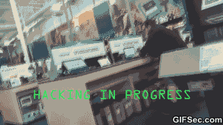

  

<h1 align="center">Hello There 👋, I'm Himanshu Handa</h1>
<h3 align="center">Passionate Software Developer and Full Stack Learner</h3>

 
🔭 I'm currently working on **A voice-controlled AI assistant inspired by Tony Stark's J.A.R.V.I.S. ** 🌱 I'm currently learning Full Stack Development 🤝 I'm looking to collaborate on VasHexad 💬 Ask me about Python, Linux System Permissions, Linux File Structure 📫 How to reach me https://www.linkedin.com/in/himanshu-handa-tech/ 📄 Know about my experiences https://himanshu-handa-enthusiast.lovable.app  

## 🌐 Socials:
 
 
 
 
 

# 💻 Tech Stack:
     
# 📊 GitHub Stats:
 
 

## 🏆 GitHub Trophies

### ✍️ Random Dev Quote

<!-- Proudly created with GPRM ( https://gprm.itsvg.in ) -->
